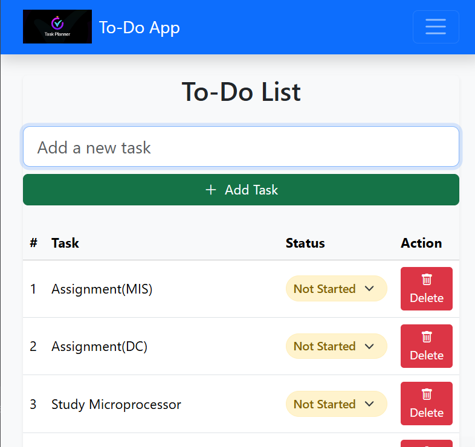

# To-Do App



A simple, responsive To-Do List application built with HTML, CSS, and JavaScript.

## Features

- Add new tasks with a description
- Track task status (Not Started, Pending, In Progress, Completed)
- Delete tasks when no longer needed
- Responsive design that works on mobile and desktop
- Persistent storage using localStorage
- Clean, intuitive user interface

## Technologies Used

- HTML5
- CSS3 (with Bootstrap 5)
- JavaScript (ES6)
- Bootstrap Icons

## Installation

No installation required! Simply open `index.html` in your web browser.

## Usage

1. Type your task in the input field
2. Click "Add Task" or press Enter
3. Change status using the dropdown menu
4. Delete tasks using the delete button

## Project Structure
```
todo-app/
├── index.html # Main application page
├── about.html # About page
├── styles.css # Custom styles
├── script.js # Application logic
├── images/ # Contains app images
│ ├── favicon.ico
│ └── logo.png
└── README.md
```

## License

This project is open-source and available under the MIT License.

## Author

**Md Tahsin Azad Shaikat**

Web developer focused on front-end, back-end, and Django, with supplementary skills in IoT and robotics.
🔗 [LinkedIn](https://www.linkedin.com/in/mdtahsinazad020/)
